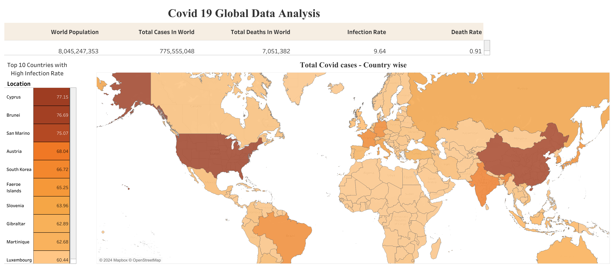
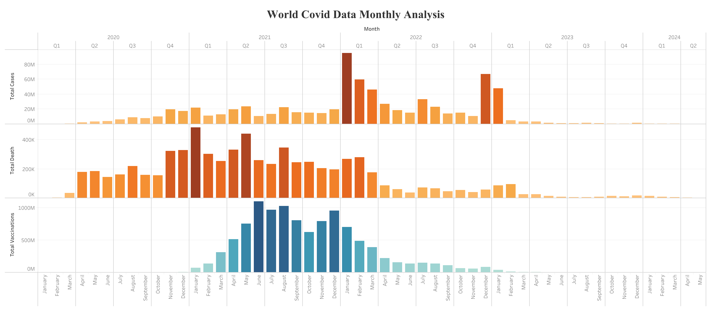
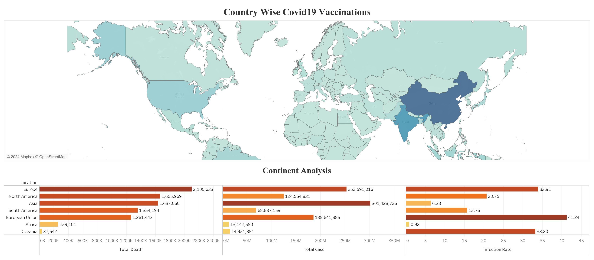

# COVID-19 Data Exploration

This repository contains SQL queries for exploring and analyzing COVID-19 data. The queries utilize various SQL skills such as joins, Common Table Expressions (CTEs), temporary tables, window functions, aggregate functions, creating views, and converting data types.

Dataset link - https://github.com/owid/covid-19-data/blob/master/public/data/owid-covid-data.csv

## Tableau Public Dashboards

We have created interactive data visualization dashboards using Tableau Public to provide insights into the COVID-19 data.

### Dashboard 1: Global COVID-19 Overview

[View on Tableau Public](https://public.tableau.com/app/profile/vinay.mandala/viz/Covid19GlobalDataAnalysis_17180187987180/Dashboard1)

### Dashboard 2: Covid Monthly Time Series Analysis

[View on Tableau Public](https://public.tableau.com/app/profile/vinay.mandala/viz/Covid19GlobalMonthlyDataAnalysis/Dashboard2)

### Dashboard 3: Country-Specific Analysis

[View on Tableau Public](https://public.tableau.com/app/profile/vinay.mandala/viz/Covid19Vaccinations_17180187698870/Dashboard3)
